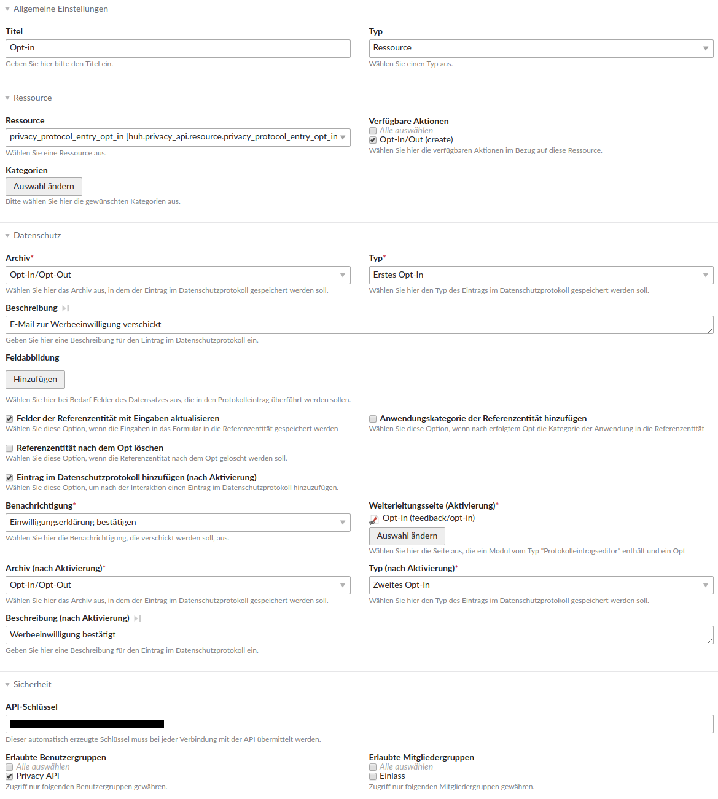

# Contao Privacy API Bundle

This bundle acts as a bridge between [heimrichhannot/contao-privacy](https://github.com/heimrichhannot/contao-privacy) and [heimrichhannot/contao-api-bundle](https://github.com/heimrichhannot/contao-api-bundle) in order to offer an API for the privacy module.

## Installation

Install via composer: `composer require heimrichhannot/contao-privacy-api-bundle` and update your database.

## Features

- offers two endpoints for privacy-related interactions: opt-in and opt-out
- calls to this endpoints result in protocol entries to be made in the protocol archive (see [heimrichhannot/contao-privacy](https://github.com/heimrichhannot/contao-privacy) for more detail on that)

## Usage

1\. After installation create a privacy protocol archive as usual (see [heimrichhannot/contao-privacy](https://github.com/heimrichhannot/contao-privacy) for more detail on that)

2\. Now navigate to the "Apps" in the contao section "API" on the left and create your opt-in endpoint. An example for a double opt-in app is given in the following image:

_HINT: Opt-out is done in a similar way._

3\. After that you can do an opt-in using the following 2 steps:

3\.1\. Do a POST request to `http://example.org/api/login/user` (or `http://example.org/api/login/member` if you like to auth via Contao members) as described in [heimrichhannot/contao-api-bundle](https://github.com/heimrichhannot/contao-api-bundle):

`curl --user user@:password -H "Content-Type: application/json" -X POST http://example.org/api/login/user`

3\.2\. The response of the request above contains your auth token. Use this to call the api endpoint you just created:

`curl --header "Authorization: Bearer <login-token>" -H "Content-Type: application/json" -X POST -d "{"gender":"male", "firstname":"John", "email":"john.doe@example.org"}" http://example.org/api/resource/privacy_protocol_entry_opt_in?key=<api_key>`